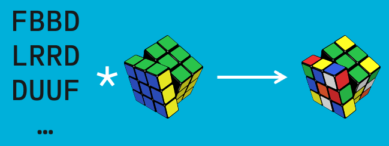

The goal of my MSC Thesis was to study post quantum signature schemes based on Cryptographic Group Actions and Code Equivalence assumptions; with a special focus on LESS and MEDS.

Supervisors: [Alessio Meneghetti](https://webapps.unitn.it/du/it/Persona/PER0126300/Didattica), [Edoardo Persichetti](https://www.persichetti.me/home) and Michele Battagliola.

A digital version of the manuscript can be downloaded <a href="https://giacomoborin.github.io/files/master/thesis/thesis_giacomoborin_online_20231117.pdf">here</a> and some slides can be found <a href="https://giacomoborin.github.io/files/slides/20240905_clusit.pdf">here</a>. A summary will follow later. As of now two works were derived from the thesis:

* [*Cutting the GRASS: Threshold GRoup Action Signature Schemes*](https://giacomoborin.github.io/publication/2023-cutting-grass), with Battagliola, Michele, Giacomo Borin, Alessio Meneghetti, and Edoardo Persichetti;
* [*A Guide to the Design of Digital Signatures based on Cryptographic Group Actions*](https://giacomoborin.github.io/publication/2024-03-09-grass), with Giacomo Borin, Edoardo Persichetti, Paolo Santini, Federico Pintore and Krijn Reijnders.

**Summary of the Thesis**  
In our every day more digital world, cryptographic signatures serve as a vital tool to ensure data integrity, authenticity, and non-repudiation. However, due to the recent advancement in the research of quantum computers, the possible implementation of quantum algorithms like Shor’s and Grover’s ones pose an existential threat to the classical public key schemes based on integers factorization and discrete logarithm, like RSA and ECDSA. 

To solve this, NIST opened a call for proposals of quantum resistant schemes, also called post-quantum cryptosystems. NIST’s standardization process has already given its first high quality schemes, but for signatures the results are not to be considered satisfactory. Thus, a new 'on ramp' call specific for signatures not based on ideal lattices has been open.

So, researchers are taking the opportunity to explore new possible mathematical tools and problems combining security, reliability and flexibility. To this end, recently Code Equivalence and other Isomorphism Problems have also been (re)discovered, emerging as an interesting assumption for new schemes. 

In particular Code Equivalence, i.e. the problem of finding the linear invertible isometry $\phi:C \to C'$ between two linear codes $C$, $C'$, combines the security of more established code-based cryptography, but can also be represented as a (non-abelian) group action, a fundamental mathematical tool, with a long history of use in cryptography, from the introduction of the discrete logarithm to isogenies between supersingular elliptic curves. 

From the problem it can naturally be defined a zero knowledge identification protocol that can be rendered to a signature with the Fiat-Shamir transform, in such a way that the security of the scheme is equivalent to the original problem. Choosing different metrics will lead to protocols that achieve different parameters: the LESS scheme uses the hamming metric, while MEDS one uses the rank metric one.

This triggered the interest of the community in studying these general frameworks. Not only to improve current schemes and understand their limits, but also to get back functionalities missing in the post-quantum scenario, like ring signatures and, in particular, threshold signatures, that distribute the right to sign messages to any subset of at least T out of N key owners; then, any subset of malicious users of size up to the threshold T won’t be able to forge a valid signature alone. These constructions 

In this thesis we recall some results and reductions for signatures and zero knowledge proof pivotal for the current NIST post-quantum cryptography call, then we go through the recent literature on cryptographic group actions and code equivalence problems, tailoring the exposition to focus on schemes submitted to the aforementioned 'on ramp' call: LESS, MEDS and partially ALTEQ.
Then, we construct a full $N$-out-of-$N$ threshold signature scheme, and discuss the efficiency issues arising from extending it to the generic $T$-out-of-$N$ case using the Replicated Secret Sharing. For that, we generalize and improve some known constructions for abelian group actions, but unrelated to any scheme submitted to NIST.
To illustrate the practicality of our designs, we subsequently implement them using two distinct varieties of code-based cryptographic group actions, namely LESS and MEDS signature schemes.

