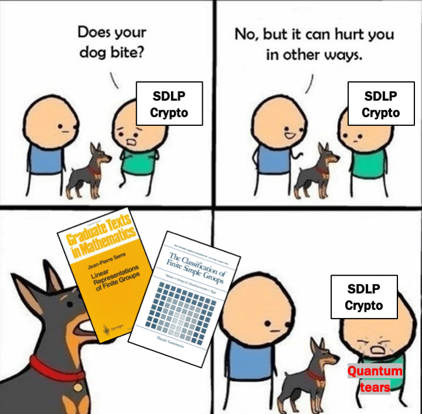

The Semidirect Discrete Logarithm Problem (SDLP) is a potentially appealing generalisation of the standard Discrete Logarithm Problem (DLP) arising from a more involved algebraic structure. It was hoped that there would be a gap between the quantum complexity of SDLP and that of DLP, allowing for development of post-quantum schemes based on SDLP.Unfortunately, in the case of SDLP with respect to finite groups, this turns out not to be the case. In this talk we present two powerful tools allowing us to reach this conclusion: the first is a method of decomposition of a generic instance of SDLP into several instances of SDLP in a finite simple group; the second is a survey of SDLP in each finite simple group, aided by the celebrated classification theorem.  

Based on <a href = 'https://eprint.iacr.org/2024/905'>a joint work</a> with Christopher Battarbee, Ryann Cartor, Nadia Heninger, David Jao, Laura Maddison, Edoardo Persichetti, Angela Robinson, Daniel Smith-Tone, Rainer Steinwandt.

Presented at <a href = 'https://csrc.nist.gov/presentations/2024/crclub-2024-07-10'>Crypto Reading Club</a> talk on 2024-Jul-10, see the slides <a href="https://giacomoborin.github.io/files/slides/20240710_SDLP_NIST_reading_club_handout.pdf">here</a>. See the preprint at <a href = 'https://ia.cr/2024/905'>ia.cr/2024/905</a>.

**Acknowledgments**. This collaboration was initiated during the *Post-Quantum Group-Based Cryptography* workshop at the American Institute of Mathematics (AIM), April 29-May 3, 2024 organized by Delaram Kahrobaei, Ludovic Perret and the AIM team.

**Summary**:

